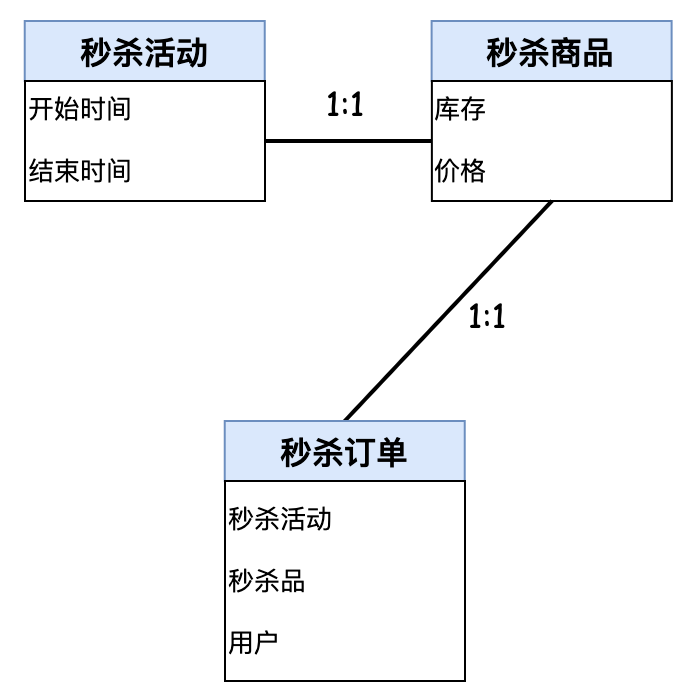
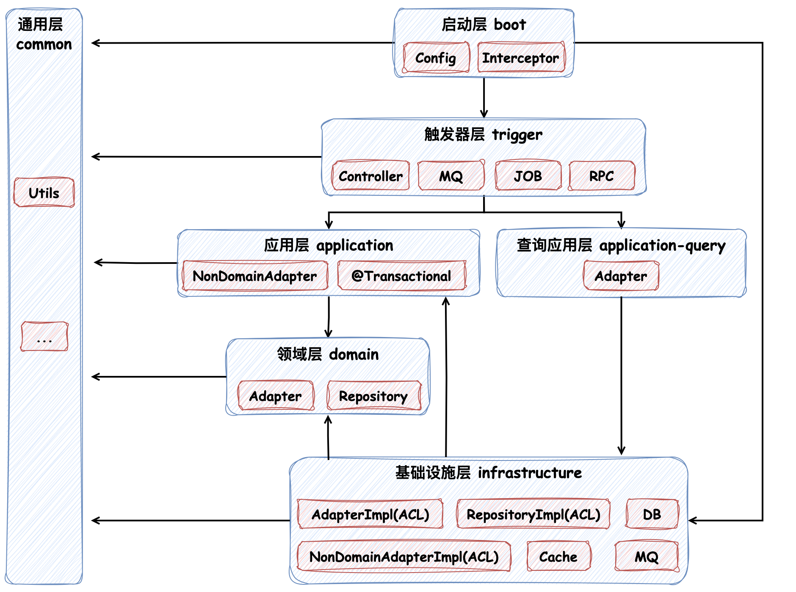

### 用例分析


如图，因为系统用例很简单，所以只提取出三个关键概念：秒杀活动、秒杀商品和秒杀订单。如果是是更复杂的系统，秒杀活动可能是隶属于"活动"概念下的一个分类，针对商品和订单也是同样地道理，这样提炼出来的概念便是更加宽泛的概念："活动"、"商品"和"订单"。

接下来需要做的就是明确概念的含义，这些含义将在日常需求沟通、产品文档和开发设计中体现：

| 概念   | Term          | 含义                          |
|------|---------------|-----------------------------|
| 秒杀活动 | flashActivity | 为达成拉新、留存和促销等业务进行的少量商品低价抢的活动 |
| 秒杀商品 | flashItem     | 针对秒杀活动创建的商品                 |
| 商品库存 | stock         | 秒杀商品的库存容量                   |
| 秒杀订单 | flashOrder    | 在秒杀活动下购买秒杀商品生成的订单           |

明确了这些概念之后，需要理清这些概念间的关系，并确定这些概念所代表的业务实体的核心属性和行为，从而得到概念模型。如下所示：



在我们当前的秒杀场景中，活动和品是 1:1 的关系，订单和品也是 1:1 的关系，并且订单和活动并没有直接关系。接下来需要根据概念模型划分子域，如下所示：


子域划分完成之后，我们需要让业务系统运转起来，那么便需要定义上下文映射，实现不同子域间的协作。秒杀活动域和秒杀订单域需要关联秒杀商品域，通过防腐层（ACL）来对接外部服务：


现在有了概念模型，便需要将其映射到代码层面的映射，定义实体、值对象和聚合根。我们先分别了解下相关概念：

- **实体**：实体是 **具有唯一标识符** 的对象，它们的生命周期可以通过其标识符来跟踪。实体的属性（比如状态）可能会发生变化，但其标识符保持不变
- **值对象**：没有唯一标识符的对象，其主要目的是描述某种属性或概念。值对象通常是不可变的
- **聚合根**：聚合根是特殊的实体，它是聚合的入口。聚合包含领域内一组相关的对象（实体与值对象等），作为一个整体对数据进行维护，在 **同一个聚合内满足业务一致性、数据完整性、状态一致性**，遵循了软件中"高内聚，低耦合"的基本原则。聚合根自然形成了一个边界，它站在这个边界上向外声明："我所包围着的内部的所有均由我负责，如果谁想访问我的内部，直接访问是被禁止的，只能通过我这个'根'来访问"

秒杀商品 `FlashItem` 将其定义成了聚合根，其中包含商品库存实体 `StockEntity` 和商品价格值对象 `ItemPrice`，商品售卖时库存发生变化；秒杀活动 `FlashActivity` 定义成了聚合根，秒杀活动的变更影响秒杀品的变更，比如秒杀活动结束，秒杀品状态变更为下架，在同一个聚合内保证它们的数据一致性；秒杀订单 `FlashOrder` 在我们的场景也定义成了聚合根，但是它并没有关联上其他需要保持数据一致性的实体，通常情况下在较为复杂的业务场景下订单聚合会比较复杂。

### 架构分层

现在我们已经定义好了各个聚合对象，接下来需要在代码层面上做实现，首先我们先看一下架构分层设计，和大多数 DDD 架构设计类似，如下所示：



#### 启动层（boot）

启动层比较简单，配置和拦截器等都定义在这一层，在 `resources` 包括配置文件和静态文件等。

#### 触发器层（trigger）

本层的作用主要是承接外部调用，包括 HTTP 接口、消息队列、定时任务等。它们的作用是将外部请求转换为应用层可以理解的命令（command）或查询（query），并将结果返回给外部。本层还有一个作用是对外防腐，即将外部调用的请求对象（Request）"留在"层内，到应用层的入参均为定义好的 Command 或 Query 对象，`convert` 包下的内容均为简单的类型转换器，它不做复杂的逻辑，仅做字段映射和类型转换。

#### 应用层（application）

应用层表象定位与 MVC 中的 `Service` 比较像，但是 `Service` 内部充满了业务功能的逻辑处理，而 DDD 中的应用层相对来说是比较薄的一层，是整个领域模型的门面，它负责做 **事务控制和逻辑编排**。像参数校验、聚合根方法调用、外部服务调用等与业务逻辑无关的代码均定义在此处。

在该层中 `adapter` 包需要关注，这个包中存放的是与领域层无关的外部接口调用，也正是架构图中体现的 `NonDomainAdapter`，用于应用层对外部接口的防腐；`assembler` 包也需要理解，它与 `convert` 包不同，`convert` 做的仅仅是类型转换和字段映射，而 `assembler` 则是将领域模型转换为应用层需要的 DTO（数据传输对象），它可以做一些业务逻辑处理，比如将领域模型中的金额转换为可读的格式等，一般用于查询接口结果对象的"组装"。

除此之外，我们还需要关注下 `ability` 包，在一些其他文章中会提到 "能力点" 这个概念，即把一个个能力（如订单创建、订单取消等逻辑）封装起来作为能力点，以实现复用。在最理想的情况下，应用层定义的 `Service` 做的是对能力点的编排。这听起来非常好，但是能力点的定义可能导致"业务知识的溢出"，也就是说原本该定义在领域服务内的业务逻辑被封装在了能力点中。

#### 领域层（domain）

领域层是整个架构的核心，包含业务逻辑和业务规则，直接反映业务的概念和流程。在该层中定义实体、聚合和值对象，采用充血模型的设计，聚合根是业务逻辑的主要载体，在理想情况下应该是业务的唯一载体。但是，有时将业务逻辑放到聚合根中是不合适的，甚至是不可行的，所以在该层中我们也定义了 **领域服务（Domain Service）**，在我们的应用中也有一系列 `DomainService` 的定义，它用来负责处理跨越聚合的操作或者处理业务逻辑中需要访问基础设层组件的操作，主要承接的是在领域对象中无法完成的逻辑，在理想情况下不应该存在领域服务，相关的业务操作都由聚合对象来完成，所以在编写业务逻辑时，还是优先在聚合对象中尝试，实在不行再引入领域服务。

注意在领域服务中，我们几乎不让它去耦合 `Repository` 相关逻辑，而是都放在了应用层去编排，这样能够防止重复查询的操作，比如在在创建订单的操作中，如果我们将 `Respository` 的查询逻辑放在领域服务中，那么在扣减库存时就需要先查询商品，后续在创建订单的逻辑也需要查询商品，那么就会导致重复查询；而且还能保证领域服务的纯粹性，领域服务只关注业务逻辑，而不关心数据的持久化和查询等操作。但是也有特例，在如下创建用户校验手机号是否重复的逻辑中，便需要 `Repository` 协助来完成，这种情况下我们可以将 `Repository` 的逻辑放在领域服务中，区别是"校验手机号是否重复属于业务逻辑"，而通用的查询或持久化不是业务逻辑，属于面向过程编程的编排逻辑：

```java
// MemberDomainService
public void changeMobile(Member member, String newMobile) {
    if (Objects.equals(member.getMobile(), newMobile)) {
        return;
    }

    if (memberRepository.existsByMobile(newMobile)) {
        throw new MryException(MEMBER_WITH_MOBILE_ALREADY_EXISTS, "修改手机号失败，手机号对应成员已存在。",
                mapOf("mobile", newMobile, "memberId", member.getId()));
    }

    member.changeMobile(newMobile, member.toUser());
}
```

领域层不依赖其它层，是独立于技术和基础设施的"业务"实现。领域层中会依赖抽象，包括仓库、外部接口调用或技术组件等，但并不对此做实现，具体实现由基础设施层去做，体现了 **依赖倒置** 的思想。其中 `adapter` 包下主要为与领域服务相关的外部接口调用适配器，同样它起到的作用也是防腐；`event` 包下定义了事件模型和事件发送器，事件发送器的具体实现在基础设施中实现，可以是消息队列或事件总线等等。如果在应用层需要调用这些事件服务组件，并不是通过直接将实现注入，而是借助"依赖倒置"，由领域层提供接口，基础设施层负责具体的实现。

##### 仓储（repository）

领域模型是针对于业务层面的，而领域模型处理完业务之后需要通过数据层存储，数据层对应的是数据模型，为了 **桥接领域模型与数据模型**，DDD 在战术设计中提出了 **仓储** 的概念。仓储的定位就是 **持久化聚合与检索聚合**，让应用服务专注逻辑编排，聚合根专注逻辑处理，并且防腐了数据模型变更对于领域模型的影响，让领域模型可以不受存储介质限制来定义业务属性，能够独立开展业务，不用关心领域模型的持久化方式与存储介质。仓储对应了领域层的 `repository` 包，仓储的实现类在基础设施层中实现。

##### 事件模型（event）

事件模型是一种用于 **解耦领域逻辑** 的设计模式，一个 **业务操作通常会导致一个结果，这个结果被称为领域事件**，即领域模型中已经发生的事情。通过发布领域事件来通知其他系统或模块某些业务行为的发生，从而避免直接调用外部服务或模块，降低耦合性。比如例如 "订单创建完成" 或 "库存更新成功" 都可以被定义为领域事件。事件的发布与业务逻辑的事务保持一致，事件发布成功也意味着业务逻辑已经完成，而事件处理失败不会影响发出方业务逻辑的完成。

针对通过事件模型实现解耦我们举一个例子，比如订单创建完成后需要给用户增长积分，如果在应用服务内实现，用户逻辑处理完，数据入库成功后，再依次调用用户增长积分的外部服务接口与赠送优惠券的外部服务接口。这样做是不是很奇怪？订单领域已经把下订单这个事情做完了，但是却还要调用其他的三方服务的接口通知它们订单生成这个事情。如果后续通知的接口越来越多，对于应用服务简直就是灾难。而通过发布一个订单创建完成的领域事件，让需要感知这个事件的服务自行监听并处理即可，这样我们便可以忽略不相关的领域活动。

#### 基础设施层（infrastructure）

基础设施层提供技术支持，负责与外部系统和技术框架的集成，它实现了领域层和应用层所需的技术细节，以及 **实现了对外部系统的防腐（ACL）**。防腐在其他的一些 DDD 文章中又被称为防腐层，基础设施层在我们的设计中承担了这部分职责，防腐主要用于 **转义内部上下文依赖的外部上下文**。我们认为一切外部服务所提供的能力或者模型都是不可靠的，它们可能会发生变更。如果我们要去使用这个能力，并减小变更带来的影响范围，那么应该依赖本系统内的适配能力接口，由接口实现类去依赖外部服务与模型，以此来实现防腐，也体现了适配器模式。除此之外，在基础设施层中仓储（repository）的实现也需要 **添加事务处理**。比如在 `FlashItemRepositoryImpl#save` 方法上标记了事务注解，因为在秒杀商品作为聚合根，其中还包含了库存实体，在保存商品数据时，涉及商品表和库存表的更新，要保证同一个聚合内的数据一致性，所以需要事务。

### CQRS

CQRS（Command Query Responsibility Segregation，命令查询职责分离）是一种架构模式，表示 **读写分离**。它将系统的操作分为两类：**命令（Command）** 和 **查询（Query）** 两者分别对应写和读操作。接下来我们介绍三种实践读写分离的方式，它们的作用和解决的问题各不相同。

#### 流程分离

最简单的读写分离模式莫过于 **读写流程的分离** 了，正如你在应用内看到的代码，在应用层的分包中有 `query` 和 `command` 两个包，分别对应了读和写相关流程：


在这种情况下读和写还是共用的一套领域模型，在比较简单的场景下没有多大的问题，但是如果面对复杂的场景可能就不合适了。比如我们有一个非常复杂的“订单”聚合根，其中包含着许多其他的聚合，当我们还在使用一套模型查询时，查询订单会将所有相关的内容全部查询出来，但是这对于我们的查询来说可能是多余的，因为我们可能并不需要所有的内容，而是只需要订单的基本信息和状态等，此时如果我们继续使用同一套领域模型来处理查询操作，便会导致查询性能下降，那么接下来便需要考虑 **模型分离**。

#### 模型分离

既然业务逻辑主要作用于写数据侧，而读数据侧主要处理的是展现逻辑，那是不是在读数据时可以绕过领域模型呢？当然可以，这就是模型分离。模型分离的主要特点是：在写数据时，依然严格按照领域模型对业务逻辑的请求处理流程，但是在读数据时，可以绕过领域模型，直接从数据库创建相应的读模型对象。


落到编码层面，在写数据侧可能需要通过 ORM 等工具完成对聚合根的持久化，但是在读数据侧则不见得，我们甚至可以通过直接的 SQL 语句从数据库中加载所需查询的数据，当然不推荐这么做，只要我们能够像在 MVC 架构下 “一气呵成” 的开发也满足了我们的诉求。

架构变更...

#### 数据源分离

模型分离已经可以解决很大一部分读写分离的问题了，不过它依然是一种相对简单的 CQRS 实现方式，对于更加复杂的查询场景来说则显得有些力不从心，因为 **模型分离事实上只是代码层面模型的分离，底层的数据库模型并未分离**，依然是读写共享同一个数据库。对于主要服务于写数据的数据库来说，可能无法满足读数据的某些查询需求，比如查询性能、数据结构等方面的需求。

所以，数据源分离便是用来解决这个问题的，在这种方式下，我们为数据查询侧单独创建一个数据库，这个数据库存在的目的仅仅是为了方便查询用，可以说是为读数据侧量身定制的，该数据库中的数据依然来自于写数据一侧，只是经过了一些预先的加工，比如根据查询端（前端）所需摒弃了一些无用的字段，或者将多个字段合并成单个字段便于前端的直接显示等。在技术栈的选择上，读数据侧的数据库不必与写数据库保持一致，可以采用更适合查询的数据库，比如 `ElasticSearch`、`Doris` 和 `Redis` 等，但是这在数据同步上会有一定的挑战。

---

总而言之，CQRS 的架构设计模式能够完成读写的职责分离，让 **命令端专注于业务逻辑和状态变更**，**查询端专注于数据展示和查询优化**，而且两者可以单独迭代和优化。既保证了在业务相关的写操作上，领域模型能够完整地反映业务逻辑，又能在查询操作上提供更高的性能和灵活性，方便开发者快速开发。

### 总结

为了对领域驱动设计有更好的理解，我们通过简单的业务场景对它进行了实践，而在实际情况下，业务场景一般会比较复杂，而且使用领域驱动设计的系统更倾向是 **中台化** 的系统。此外，对领域驱动设计方法下的软件架构分层我们也给出了详细的解释，但是大家也需要将次奉为圭臬，我认为如果能在软件架构中保证 **业务知识（或领域）的集中** 与 **对外部系统的防腐** 都是较为合适的软件架构设计，反观当下流行的各种软件架构，无论是分层架构、六边形架构还是整洁架构，它们都有一个共同点，即在架构中心都有一个 **核心** 存在，这个核心正是 **领域模型**，各个聚合根也存在于领域模型之中。


每种架构中都有为领域模型预留的位置，这也意味着 DDD 可以采用任何一种软件架构。希望大家在执行领域驱动设计方法时不拘泥于概念和细节，能够大胆地去尝试。

---

### 推荐阅读

- [码如云文档中心: 构建自己的软件大厦](https://docs.mryqr.com/build-your-own-software-skyscraper/)
